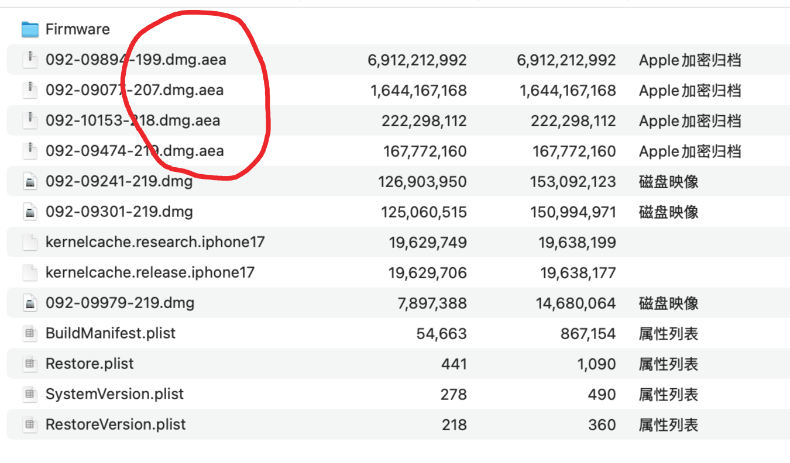

### 下载链接 [apple.aea](https://github.com/pxx917144686/apple.aea/archive/refs/heads/main.zip)

### apple.aea [iPhone_.ipsw](https://ipsw.dev/product/iPhone)




---

## 终端执行：

### 解压 `apple.aea-main.zip`

cd apple.aea-main 文件夹
```bash
cd aeota
python3 -m venv .env
source .env/bin/activate
```

## 执行aea文件夹中的 get_key.py

```bash
cd aea
python3 get_key.py <拖入 .aea 文件到终端>
```

**执行成功 ——> 得到密钥**  
例如：`'GwXUyztBvIPzXjbfcFkZ9IEBI561oI02b/nkQijCCng='`

---

## 开始解密 `.aea` 文件

### 终端执行

```bash
./
aea decrypt -i <拖入 .aea 文件到终端> -o <解密后的路径> -key-value 'base64:GwXUyztBvIPzXjbfcFkZ9IEBI561oI02b/nkQijCCng='
```


---

## 关于 制作 `iphone_.ipcc` 文件

1. 路径：`system -> library -> carrier bundles -> iphone`  
   此目录中包含众多的 `.IPCC` 文件。

2. 找到需要的 `.IPCC` 文件，将对应的 `xxxx.bundle` 放入新建文件夹 **Payload**。

3. 将 **Payload** 文件夹压缩为 ZIP 文件。

4. 将 ZIP 文件后缀名改为 `.ipcc`。
